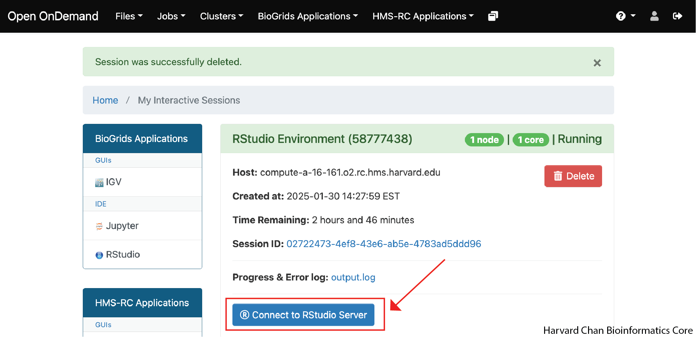
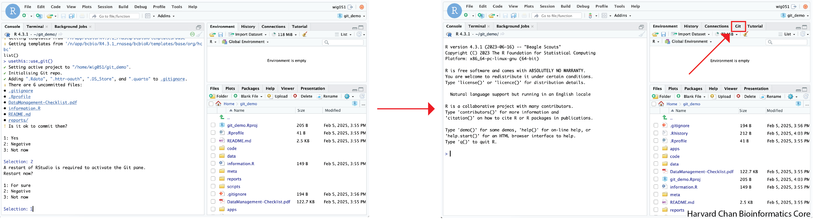

# Welcome to HCBC Platform

Welcome to our Platform guidelines web-page. Here analysts and developers will find guidelines on how to work with our most common environments.

We are developing platforms for each analysis type we have experience with at HCBC.

Go to each analysis-type section to learn how to use our platform.

## Set up the package

Log onto O2 via the command line and check two things (first-time only): 

   * Remove `bcbio` from you `PATH` by commenting the line in your `.bashrc` if you have it
   * Remove any path you load using the R env variables that could be in your `.Rprofile` or `.bashrc`

Go to the [O2 Portal](https://o2portal.rc.hms.harvard.edu/) and select `HMS-RC Application`, then `RStudio Environment`
<p align="center"></p>

Start Rstudio with using your desired partition, memory, core and time directives. Add these modules to "Modules to be loaded":
  ```
  git/2.9.5  gcc/9.2.0 imageMagick/7.1.0 geos/3.10.2 cmake/3.22.2 R/4.3.1 fftw/3.3.10 gdal/3.1.4 udunits/2.2.28  boost/1.75.0
  ```
   Click "Launch"

<p align="center"></p>

Open RStudio by clicking on the "Connect to RStudio Server"

<p align="center"></p>

When the session is started, set you library path typing this command in your console Rstudio window in order to be able to load bcbioR:

```
.libPaths("/n/app/bcbio/R4.3.1")
```

Next, load bcbioR with:

```
library(bcbioR)
```

Check the package version of bcbioR using:

```
packageVersion("bcbioR")
```

Make sure the version is **0.3.*** or later.

<p align="center"></p>

> Note: If you are working in your local environment, install bcbioR with
> ```
> devtools::install_github("bcbio/bcbioR",build_manual = TRUE, build_vignettes = TRUE)
> ``` 

## General Project

Use this [HCBC app](https://hcbc.connect.hms.harvard.edu/content/8cd62872-0ec9-4905-8920-c745d2375758) to set up a project's name. This name will be used for O2, FAS, GitHub and Dropbox. They may be already defined in the Trello card.

This set up needs [bcbioR](https://github.com/bcbio/bcbioR) and [usethis](https://usethis.r-lib.org) packages. If you are working on the O2 Portal `usethis` is within `/n/app/bcbio/R4.3.1`, so you will not need to install it. Also, `usethis` is a dependency of `bcbioR`, so if you are working locally it should have come along with the download of `bcbioR`.

### Create the Rstudio project

Assign the path that you will be using as the path for your project to the object `project_path` into the `PIs` space on O2:

```
project_path <- "/n/data1/cores/bcbio/PIs/PI_name/lastname_postdoc_rnaseq_human_heart_hbc00000"
```

Now, we will need to create a directory using this path to put our analysis in. If this directory already exists, then you can skip this step. The directory creation can be done with this command:

```
dir.create(project_path)
```

Now, we can open a Rproject for our analysis in this path using:

```
usethis::proj_activate(project_path)
```

> Note: This will restart the session in the project directory. This restart will clear the `.libPaths("/n/app/bcbio/R4.3.1")` and `library(bcbioR)` that we used earlier, so we will need to re-do them in the following steps. 

### Setting up your workspace

We will now add the `.libPath()` that is appropriate for our type of analysis. You can use the table below to determine which `.libPath()` is appropriate for your analysis:

| Type of Analysis | `.libPath()` command |
|:---:|:---|
| Bulk RNA-seq| `.libPaths("/n/app/bcbio/R4.3.1_rnaseq")` |
| Single-cell RNA-seq | `.libPaths("/n/app/bcbio/R4.3.1_singlecell")` |
| ChIP-Seq | `.libPaths("/n/app/bcbio/R4.3.1_chipseq")` |
| CellChat | `.libPaths("/n/app/bcbio/R4.3.1_cellchat")` |
| DNA Methylation | `.libPaths("/n/app/bcbio/R4.3.1_methylation")` |


Since our loaded libraries were wiped when we created a new project, we will need to reload `bcbioR`:

```
library(bcbioR)
```

Once again, let's just double check our version of bcbioR to make sure we are using version **0.3.** or later.

```
packageVersion("bcbioR")
```

Next we need to set the library that `bcbioR` will use each time you open up this RStudio project. By using the `bcbioR::use_library()`, you will be adding the path to your project `.Rprofile` and this will be sourced each time when you open the RStudio project.

| Type of Analysis | `bcbioR::use_library()` command |
|:---:|:---|
| Bulk RNA-seq| `bcbioR::use_library("/n/app/bcbio/R4.3.1_rnaseq")` |
| Single-cell RNA-seq | `bcbioR::use_library("/n/app/bcbio/R4.3.1_singlecell")` |
| ChIP-Seq | `bcbioR::use_library("/n/app/bcbio/R4.3.1_chipseq")` |
| CellChat | `bcbioR::use_library("/n/app/bcbio/R4.3.1_cellchat")` |
| DNA Methylation | `bcbioR::use_library("/n/app/bcbio/R4.3.1_methylation")` |

Now, we will use `bcbioR` to set-up the directory structure that we will be using for our analysis using the following command:

```
bcbioR::bcbio_templates(type="base", outpath=".", org="hcbc")
```

### Setting up GitHub

#### Making your `.gitconfig` file (First time on O2 only)

If it is your first time using Git on O2, you will need to do make your `.gitconfig` file.  In order to do this, you will need to run the following command:

```
usethis::use_git_config(user.name = "your_GitHub_username", user.email = "your_email@gmail.com")
```

You will replace `your_GitHub_username` with your GitHub user name and `your_email@gmail.com` with the e-mail associated with your GitHub account.

> Note: If you already have your GitHub username and e-mail associated with your GitHub account in your `.gitconfig` file then you can skip this step.

You can check that you have successfully made this `.gitconfig` file by looking for the hidden file in your home directory. The content should look like:

```
.gitconfig
```

```
[user]
	email = your_email@gmail.com
	name = your_GitHub_username
```


#### Creating a token

```
ℹ Defaulting to "https" Git protocol.
Error in `usethis::use_github()`:
✖ Unable to discover a GitHub personal access token.
ℹ A token is required in order to create and push to a new repo.
☐ Call usethis::gh_token_help() for help configuring a token.
Run `rlang::last_trace()` to see where the error occurred.
```

Then you will need to create a new GitHub token. In order to create a GitHub token, you will need to run:

We can see that it is recommending that we create a GitHub Token with this command:

```
usethis::create_github_token()
```

This will take you to a GitHub HTML. It may prompt you to sign-in to GitHub. From here, you need to name your token and select an expiration date for your token. Then, scroll to the bottom of the page and left-click <kbd>Generate token</kbd>. These step are summarized in the GIF below:

<p align="center"></p>

Next, you will want to copy your GitHub Token and go back to RStudio.

Read the REAME and any other Management checklist that is in the project folder. Now we need to set our credentials by using the command:

```
gitcreds::gitcreds_set()
```

Paste in your copied GitHub token and hit <kbd>Return/Enter</kbd>. It should return:

```
-> Adding new credentials...
-> Removing credentials from cache...
-> Done.
```

These steps are summarized in the GIF below:

<p align="center"></p>

---

#### Scratch space

Now we will need to start the Git Repository using this command:

```
usethis::use_git()
```

This will return:

```
✔ Setting active project to "/home/wig051/git_demo".
✔ Initialising Git repo.
✔ Adding ".Rdata", ".httr-oauth", ".DS_Store", and ".quarto" to .gitignore.
ℹ There are 6 uncommitted files:
• .gitignore
• .Rprofile
• DataManagement-Checklist.pdf
• information.R
• README.md
• reports/
! Is it ok to commit them?

1: Yes
2: Negative
3: Not now
```

We do not want to commit these files yet, so select either `Negative`, `No way` or `No`.

**Alex are we sure we don't want to commit?**

Next, you will be prompted as to whether you want to restart R:

```
A restart of RStudio is required to activate the Git pane.
Restart now?

1: For sure
2: Negative
3: Not now
```

We will need to restart R in order to get the Git pane in our R Studio, so select `For sure` or `Yeah`. We show this transition below:

<p align="center"></p>

Push this project to GitHub following these steps:

```
usethis::use_github(org="hbc",private=TRUE)
```

```
ℹ Defaulting to "https" Git protocol.
✔ Setting active project to "/home/wig051/git_demo".
Error in `guess_local_default_branch()`:
✖ Can't find any local branches.
  Do you need to make your first commit?
Run `rlang::last_trace()` to see where the error occurred.
```


  * **NOTE** You may want to run this first to keep this token working in future sessions in O2/FAS: `git config --global credential.helper store`
* Push repository to HBC github as private: `usethis::use_github(org="hbc",private=TRUE)`


## RNAseq

Use this common library path to perform your analysis: `bcbio::use_library("/n/app/bcbio/R4.3.1_rnaseq")`.
* Follow the previous step to set up the [base](#general-project) project if you haven't done it already
* Deploy templates with:

```
bcbioR::bcbio_templates(type="rnaseq", outpath="reports")
```


## scRNAseq

Please, change to this common library path to perform your analysis: 

```
bcbioR::bcbio_templates(type="singlecell", outpath="reports")
```

## ChipSeq

Please, change to this common library path to perform your analysis: 

```
bcbioR::bcbio_templates(type="chipseq", outpath="reports")
```

# bcbioR supported templates

We used `bcbioR` to deploy folders and code to our project directories to improve robustness in our analysis.

You can install `bcbioR` as indicated here: `https://github.com/bcbio/bcbioR/tree/main`

- RNAseq 
- ChipSeq 
- scRNAseq 
- CELLCHAT 
- TEASeq 
- COSMX 


# Note
>These materials have been developed by members of the teaching and platform team at the Harvard Chan Bioinformatics Core (HBC) RRID:SCR_025373. 
